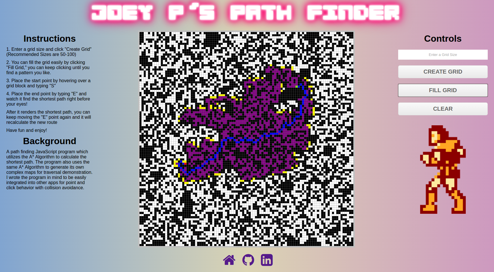

# Joey P's Path Finder

[Joey P's Path Finder Live Version](http://www.josephpuchalski.com/maze_solver/)

## Background

A path finding JavaScript program which utilizes the A\* Algorithm to calculate the shortest path. The program also uses the same A* Algorithm to generate its own complex maps for traversal demonstration. I wrote the program in mind to be easily integrated into other apps for point and click behavior with collision avoidance.

It is built in JavaScript and utilizes the jQuery library.

## How to Control

It is very easy to get started. You can choose a grid size of your choice, just enter an amount and click on "Create Grid" button. Recommended grid sizes for demonstrative purposes can range from 50 to 100.

Once you create a grid, then you can automatically populate it full of collision blocks to avoid. All you need to do is click on the "Fill Grid" button. You can keep clicking this until you find a pattern you like. If you are feeling really crafty, you can also create a custom grid by either clicking on the grid blocks turning them black or by hovering over them and typing "B".

To set the Start Point, all you need to do is hover over a grid block and type "S". A green square will appear on the screen indicating you placed the point.

To place the End Point, just type "E" anywhere on the grid. It will then calculate the shortest path to your destination. You can also randomly place "E" again after the path was defined and see it recalculate to the new path!

You will see a growth of purple squares, edges of yellow squares, and a pathway of blue squares.

The purple squares represent all the grid blocks that were looked at by the algorithm and considered.

The yellow squares represent all the grid blocks that were looked at but never considered.

The pathway of blue squares represent the shortest path in the given pattern map to that end location.

## Features

There are many features included in this Path Finding application:

### Custom Fixed Grid Creation
  You are able to create a completely custom grid within a fixed shape. The grid squares will autoresize themselves to make sure they do not overflow out of the square. You are then able to add collision blocks simply by clicking on a block or typing "B" while hovering over it.

  The cap for the grid size for the application is 100 due to processing purposes, but it is easily unlocked to have any desired amount.

### 4 Movement Modes

 It leverages the shortest path by default, but can also be extended to work with other specific movement conditions, such as:
- Makes only orthogonal moves
- Makes only diagonal moves
- Makes orthogonal moves and diagonal moves unless they are near a "block"
- Makes orthogonal moves and diagonal moves to find shortest path

### Pattern Generation

  By utilizing the A\* algorithm, you are able to generate a randomized pattern of collision blocks. This was accomplished by allowing the A* to search through the map for an enclosed end point. This also filters out any pathways that would not be accessible, so that you will always be able to find a pathway from your start point to your end point.

## Future Applications

  The program was designed to be used in other game applications as well for those who wish to utilize the path finding ability in their games, such as Turn Based Strategy and Real Time Strategy games.
